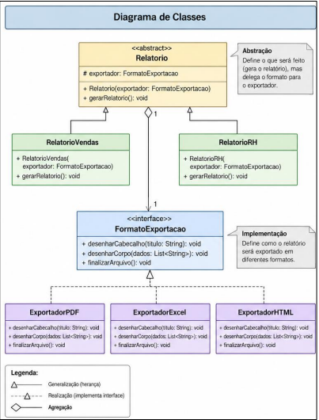
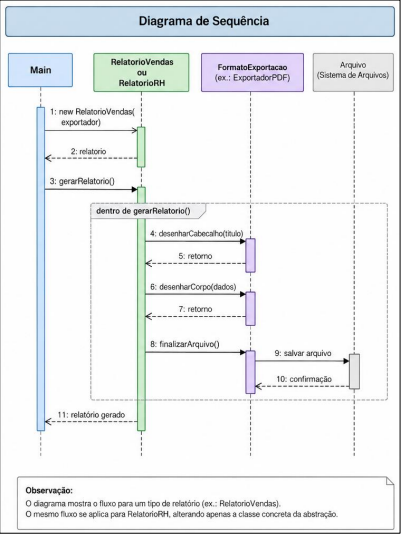

# TechFatec - Relatorios com Bridge

Projeto academico em Java que aplica o padrao **Bridge** ao modulo de relatorios.

## Problema resolvido

O sistema precisa gerar os relatorios de **Vendas** e **Desempenho de RH** nos formatos **PDF**, **XLSX** e **HTML**. Sem Bridge, cada combinacao exigiria uma classe, como `RelatorioVendasPdf` ou `RelatorioRHHHtml`.

Com o Bridge, os dois eixos variam de forma independente:

- **Abstracao:** `Relatorio`, `RelatorioVendas` e `RelatorioRH`.
- **Implementacao:** `FormatoExportacao`, `ExportadorPdf`, `ExportadorXlsx` e `ExportadorHtml`.

## Estrutura exigida

```text
src/
├── abstracao/
│   ├── Relatorio.java
│   ├── RelatorioVendas.java
│   └── RelatorioRH.java
├── implementacao/
│   ├── FormatoExportacao.java
│   ├── ExportadorPdf.java
│   ├── ExportadorXlsx.java
│   └── ExportadorHtml.java
└── cliente/
    └── Main.java
```
## Diagramas

### Diagrama de classes



### Diagrama de sequência



## Injecao de dependencia

`Relatorio` recebe `FormatoExportacao` no construtor. Nenhuma classe de relatorio instancia diretamente um exportador concreto. A `Main` e o ponto de composicao: ela cria e injeta PDF, XLSX ou HTML.

O metodo `setExportador(...)` permite a troca dinamica de formato no mesmo objeto de relatorio.

## Validacao solicitada

A classe `cliente.Main` demonstra no console:

1. Relatorio de Vendas em PDF;
2. Alteracao do mesmo relatorio de vendas para XLSX em tempo de execucao;
3. Relatorio de Desempenho de RH em HTML.

## Como executar

Pre-requisito: JDK 17 ou superior.

```bash
javac -d out src/abstracao/*.java src/implementacao/*.java src/cliente/*.java
java -cp out cliente.Main
```
